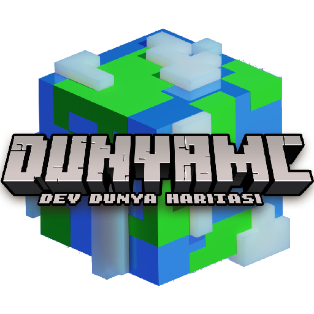

<p align="center"></p>

<h1 align="center">Selvania Launcher</h1>

[<p align="center">
](https://github.com/luuxis/Selvania-Launcher/releases) 
[](https://github.com/luuxis/Selvania-Launcher/releases) 
[](https://github.com/luuxis/Selvania-Launcher/releases)

</p>


---

**Kullanım Şartları**
- Kodu kullanmak için projeyi forklamalısınız.
- Kodu kullanmak için kodunuz her zaman herkese açık olmalıdır.
---

**Klonlama ve bağımlılıkları yükleme**

'''console
> git clone https://github.com/bynoment/DunyaMC-Launcher-master
> cd DunyaMC-Launcher-master
> npm install
```
---

**Uygulamayı başlat**

```console
> npm start
```
---

**Build**

| Platform    | Command              |
| ----------- | -------------------- |
| Windows  | `npm run build:win`   |
| macOS    | `npm run build:mac`   |
| Linux    | `npm run build:linux` |

---


---
**<p align="center">Launcheri düzenleyin.</p>**

- [Dokümanlar](./wiki.md).

---

[<p align="center">](https://discord.gg/e9q7Yr2cuQ) 
---

[releases]: https://github.com/bynoment/DunyaMC-Launcher-master/releases 'releases'
[build]: https://github.com/bynoment/DunyaMC-Launcher-master/releases 'build'


